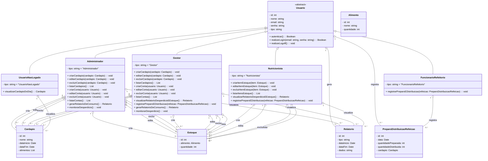

```mermaid
classDiagram
    Usuario <|-- Administrador
    Usuario <|-- Nutricionista
    Usuario <|-- Gestor
    Usuario <|-- FuncionarioRefeitorio
    Usuario <|-- UsuarioNaoLogado

    class Usuario {
    <<abstract>>
    - id: int
    - nome: string
    - email: string
    - senha: string
    - tipo: string
    + autenticar(): Boolean
    + realizarLogin(email: string, senha: string): Boolean
    + realizarLogoff(): void
    }

    class Administrador {
    - tipo: string = "Administrador"
    + criarCardapio(cardapio: Cardapio): void
    + editarCardapio(cardapio: Cardapio): void
    + excluirCardapio(cardapio: Cardapio): void
    + listarCardapios(): List<Cardapio>
    + criarConta(usuario: Usuario): void
    + editarConta(usuario: Usuario): void
    + excluirConta(usuario: Usuario): void
    + listarContas(): List<Usuario>
    + gerarRelatorioDeConsumo(): Relatorio
    + monitorarDesperdicio(): void
    }

    class Nutricionista {
    - tipo: string = "Nutricionista"
    + criarItemEstoque(item: Estoque): void
    + editarItemEstoque(item: Estoque): void
    + excluirItemEstoque(item: Estoque): void
    + listarItensEstoque(): List<Estoque>
    + visualizarRelatorioDesperdicioEEstoque(): Relatorio
    + registrarPreparoEDistribuicao(refeicao: PreparoDistribuicaoRefeicao): void
    }

    class Gestor {
    - tipo: string = "Gestor"
    + criarCardapio(cardapio: Cardapio): void
    + editarCardapio(cardapio: Cardapio): void
    + excluirCardapio(cardapio: Cardapio): void
    + listarCardapios(): List<Cardapio>
    + criarConta(usuario: Usuario): void
    + editarConta(usuario: Usuario): void
    + excluirConta(usuario: Usuario): void
    + listarContas(): List<Usuario>
    + visualizarRelatorioDesperdicioEEstoque(): Relatorio
    + registrarPreparoEDistribuicao(refeicao: PreparoDistribuicaoRefeicao): void
    + gerarRelatorioDeConsumo(): Relatorio
    + monitorarDesperdicio(): void
    }

    class FuncionarioRefeitorio {
    - tipo: string = "FuncionarioRefeitorio"
    + registrarPreparoEDistribuicao(refeicao: PreparoDistribuicaoRefeicao): void
    }

    class UsuarioNaoLogado {
    - tipo: string = "UsuarioNaoLogado"
    + visualizarCardapioDoDia(): Cardapio
    }

    class Cardapio {
    - id: int
    - nome: string
    - dataInicio: Date
    - dataFim: Date
    - alimentos: List<Alimento>
    }

    class Alimento {
    - id: int
    - nome: string
    - quantidade: int
    }

    class Estoque {
    - id: int
    - alimento: Alimento
    - quantidade: int
    }

    class Relatorio {
    - id: int
    - tipo: string
    - dataInicio: Date
    - dataFim: Date
    - dados: string
    }

    class PreparoDistribuicaoRefeicao {
    - id: int
    - data: Date
    - quantidadePreparada: int
    - quantidadeDistribuida: int
    - cardapio: Cardapio
    }

    Usuario "1" o-- "0..*" Relatorio : gera
    Usuario "1" o-- "0..*" PreparoDistribuicaoRefeicao : registra
    Administrador "1" o-- "0..*" Cardapio : cria
    Administrador "1" o-- "0..*" Cardapio : edita
    Administrador "1" o-- "0..*" Cardapio : exclui
    Administrador "1" o-- "0..*" Estoque : cria
    Administrador "1" o-- "0..*" Estoque : edita
    Administrador "1" o-- "0..*" Estoque : exclui
    Administrador "1" o-- "0..*" Estoque : lista
    Administrador "1" o-- "0..*" Relatorio : visualiza
    Gestor "1" o-- "0..*" Cardapio : cria
    Gestor "1" o-- "0..*" Cardapio : edita
    Gestor "1" o-- "0..*" Cardapio : exclui
    Gestor "1" o-- "0..*" Estoque : cria
    Gestor "1" o-- "0..*" Estoque : edita
    Gestor "1" o-- "0..*" Estoque : exclui
    Gestor "1" o-- "0..*" Estoque : lista
    Gestor "1" o-- "0..*" Relatorio : visualiza
    Nutricionista "1" o-- "0..*" Estoque : cria
    Nutricionista "1" o-- "0..*" Estoque : edita
    Nutricionista "1" o-- "0..*" Estoque : exclui
    Nutricionista "1" o-- "0..*" Estoque : lista
    Nutricionista "1" o-- "0..*" Relatorio : visualiza
    FuncionarioRefeitorio "1" o-- "0..*" PreparoDistribuicaoRefeicao : registra
    UsuarioNaoLogado "1" o-- "0..*" Cardapio : visualiza
```